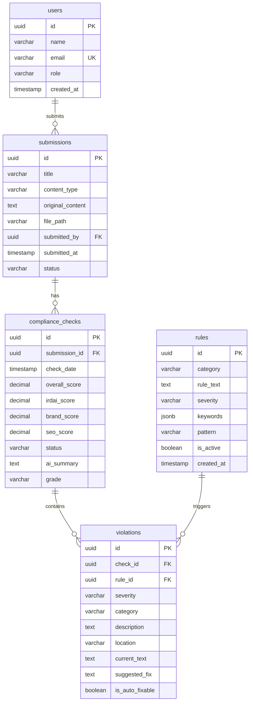

# Project Understanding: Compliance Agent POC

> **Last Updated**: 2025-12-05  
> **Purpose**: AI-powered compliance checking system for insurance marketing content

---

## Overview

This is a **Compliance Agent POC (Proof of Concept)** that automatically checks marketing content against **IRDAI (Insurance Regulatory and Development Authority of India) regulations** and **Bajaj Life Insurance brand guidelines**. It uses **Ollama LLM** for AI-powered analysis.

### Core Workflow
```
User uploads content → AI analyzes for compliance → Generates violations/scores → User reviews results
```

---

## Architecture

### Tech Stack
| Layer | Technology |
|-------|------------|
| **Backend** | FastAPI (Python 3.11), PostgreSQL 15, Redis 7 |
| **Frontend** | React 18 + TypeScript, Vite 5, Tailwind CSS |
| **AI/LLM** | Ollama (qwen2.5:7b model) |
| **ORM** | SQLAlchemy 2.0 + Alembic migrations |
| **Containerization** | Docker + Docker Compose |

---

## Database Schema



### Key Tables
| Table | Purpose |
|-------|---------|
| `users` | Store user accounts (agents) |
| `submissions` | Content uploaded for compliance checking |
| `compliance_checks` | Results of AI compliance analysis |
| `rules` | Compliance rules (IRDAI, Brand, SEO) |
| `violations` | Specific rule violations found in content |

---

## Backend Structure

```
backend/app/
├── main.py              # FastAPI application entry
├── config.py            # Environment configuration
├── database.py          # SQLAlchemy database connection
├── models/              # SQLAlchemy ORM models
│   ├── user.py          # User model
│   ├── submission.py    # Submission model
│   ├── compliance_check.py
│   ├── violation.py
│   └── rule.py
├── schemas/             # Pydantic request/response schemas
├── services/            # Business logic
│   ├── ollama_service.py      # LLM integration ⭐
│   ├── compliance_engine.py   # Core compliance logic ⭐
│   ├── content_parser.py      # File parsing (HTML/MD/PDF/DOCX)
│   └── scoring_service.py     # Score calculation
├── api/routes/          # API endpoints
└── seed_data.py         # Initial compliance rules
```

### Key Services

#### 1. OllamaService (`ollama_service.py`)
- Integrates with Ollama LLM via HTTP API
- Supports chat and generate APIs
- Retry mechanism with exponential backoff
- Fallback response when unavailable

#### 2. ComplianceEngine (`compliance_engine.py`)
- Core analysis workflow:
  1. Load submission content
  2. Fetch active rules from database
  3. Build compliance prompt
  4. Send to Ollama for analysis
  5. Parse AI response
  6. Calculate scores
  7. Store violations

#### 3. ScoringService (`scoring_service.py`)
- Weighted scoring algorithm:
  - **Critical violation**: -20 points
  - **High severity**: -10 points
  - **Medium severity**: -5 points
  - **Low severity**: -2 points
- Overall score = (IRDAI × 50%) + (Brand × 30%) + (SEO × 20%)
- Grading: A (90-100), B (80-89), C (70-79), D (60-69), F (<60)

---

## Frontend Structure

```
frontend/src/
├── App.tsx              # Main app with routing
├── main.tsx             # Entry point
├── pages/
│   ├── Dashboard.tsx    # Overview stats and charts
│   ├── Upload.tsx       # Content upload interface
│   ├── Submissions.tsx  # List of all submissions
│   └── Results.tsx      # Compliance check results
├── components/          # Reusable UI components
├── lib/
│   ├── api.ts           # Axios API client
│   ├── types.ts         # TypeScript interfaces
│   └── utils.ts         # Utility functions
└── index.css            # Global styles
```

### Key Pages
| Page | Route | Purpose |
|------|-------|---------|
| Dashboard | `/` | Stats overview, recent activity |
| Upload | `/upload` | File upload + compliance check trigger |
| Submissions | `/submissions` | List all uploaded content |
| Results | `/results/:id` | Detailed compliance results |

---

## API Endpoints

### Submissions
| Method | Endpoint | Description |
|--------|----------|-------------|
| POST | `/api/submissions/upload` | Upload content file |
| GET | `/api/submissions` | List all submissions |
| GET | `/api/submissions/{id}` | Get submission details |
| POST | `/api/submissions/{id}/analyze` | Trigger compliance analysis |

### Compliance
| Method | Endpoint | Description |
|--------|----------|-------------|
| GET | `/api/compliance/{submission_id}` | Get compliance results |
| GET | `/api/compliance/{submission_id}/violations` | Get violations only |

### Dashboard
| Method | Endpoint | Description |
|--------|----------|-------------|
| GET | `/api/dashboard/stats` | Dashboard statistics |
| GET | `/api/dashboard/recent` | Recent submissions |

---

## Compliance Rules (Pre-seeded)

### IRDAI Rules (5)
1. No misleading claims about returns/guarantees
2. Proper risk disclosures required
3. No medical condition misrepresentation
4. Factual competitor comparisons only
5. Clear fee disclosure required

### Brand Rules (4)
1. Use of full company name
2. Prohibited words avoidance
3. Professional tone and voice
4. Visual guidelines compliance

### SEO Rules (4)
1. Title length optimization (50-60 chars)
2. Meta description presence
3. Keyword placement (H1, first paragraph)
4. Image alt text requirements

---

## Running the Project

```bash
# Start all services
docker-compose up -d

# Pull AI model
docker-compose exec ollama ollama pull qwen2.5:7b

# Run migrations
docker-compose exec backend alembic upgrade head

# Seed database
docker-compose exec backend python -m app.seed_data
```

### Access Points
- **Frontend**: http://localhost:5173
- **API Docs**: http://localhost:8000/docs
- **Health Check**: http://localhost:8000/health

---

## Change Log

| Date | Change | Files Affected |
|------|--------|----------------|
| 2025-12-05 | Initial project understanding document created | `PROJECT_UNDERSTANDING.md` |

---

## Known Limitations (MVP)

1. No authentication (all users same access)
2. Synchronous analysis (no background queue)
3. Content truncated to first 3000 characters
4. 50MB max file upload
5. No real-time updates (manual refresh needed)

---

---

## Phase 2: Dynamic Rule Generation & Admin Dashboard

**Implemented**: December 05, 2025
**Status**: Complete

### Overview

Phase 2 adds dynamic rule generation capabilities and a super admin dashboard for managing compliance rules. This phase enables non-technical administrators to:
- Upload regulatory documents and automatically extract rules using AI
- Manage rules through a web interface (create, read, update, delete)
- Configure point deductions for custom scoring weights
- Track rule creation and attribution

### Key Features

#### 1. Dynamic Rule Generation

**Upload Document → AI Extraction → Database Storage**

- **Supported Formats**: PDF, DOCX, HTML, Markdown
- **LLM Integration**: Uses Ollama (qwen2.5:7b) for structured rule extraction
- **Validation**: Automatic rule validation with retry logic
- **Attribution**: Tracks which super admin created each rule

**Workflow**:
1. Super admin uploads compliance document
2. Backend parses document content (PDF/DOCX/HTML/MD)
3. Ollama extracts 5-15 rules in JSON format
4. Rules validated and stored in database
5. Creator attribution linked via `created_by` FK

**Example API Call**:
```bash
POST /api/admin/rules/generate
Content-Type: multipart/form-data
X-User-Id: {super_admin_uuid}

{
  "file": [document file],
  "document_title": "IRDAI Marketing Guidelines 2024"
}
```

#### 2. Configurable Scoring

**DB-Driven Point Deductions**

Phase 2 moves scoring weights from hardcoded values to database-stored `points_deduction` field.

**Benefits**:
- Adjust point deductions without redeployment
- Fine-tune scoring based on regulatory importance
- A/B test different penalty structures

**Database Changes**:
- Added `rules.points_deduction` (Numeric 5,2, default -5.00)
- Scoring service now queries DB for rule-specific points
- Falls back to severity-based weights if rule not found

**Example Point Deductions**:
| Severity | Default Points | Customizable Range |
|----------|---------------|-------------------|
| Critical | -20.00 | -20.00 to -15.00 |
| High | -10.00 | -15.00 to -10.00 |
| Medium | -5.00 | -10.00 to -5.00 |
| Low | -2.00 | -5.00 to -2.00 |

#### 3. Super Admin Dashboard

**React Admin Interface (`/admin`)**

Full-featured admin dashboard with:
- **Rule Statistics**: Total, active, by category, by severity
- **Upload Interface**: Drag-and-drop document upload
- **Rule Table**: Sortable, filterable, paginated list
- **Inline Editing**: Update rules without page reload
- **Search**: Full-text search in rule descriptions

**Features**:
- TanStack Table for high-performance data grid
- Real-time filters (category, severity, active status)
- Pagination (20 rules per page)
- Edit modal with form validation
- Soft delete (sets `is_active = false`)

#### 4. Role-Based Access Control

**POC Implementation**:
- Simple header-based auth: `X-User-Id` header
- User roles: `agent`, `reviewer`, `super_admin`
- All admin endpoints protected by `require_super_admin` dependency
- Returns 403 Forbidden for non-super-admin users

**Production TODO**: Replace with JWT/OAuth2

### Database Schema Updates

**New Fields in `rules` Table**:
```sql
ALTER TABLE rules ADD COLUMN points_deduction NUMERIC(5,2) NOT NULL DEFAULT -5.00;
ALTER TABLE rules ADD COLUMN created_by UUID REFERENCES users(id) ON DELETE SET NULL;

CREATE INDEX ix_rules_created_by ON rules(created_by);
CREATE INDEX ix_rules_category ON rules(category);
CREATE INDEX ix_rules_severity ON rules(severity);
```

**New Relationship in `users` Table**:
```python
class User(Base):
    role = Column(String(50), default="agent")  # agent, reviewer, super_admin
    created_rules = relationship("Rule", back_populates="creator")
```

### API Endpoints (Phase 2)

| Method | Endpoint | Description | Auth Required |
|--------|----------|-------------|---------------|
| POST | `/api/admin/rules/generate` | Generate rules from document | super_admin |
| GET | `/api/admin/rules` | List all rules (paginated) | super_admin |
| GET | `/api/admin/rules/{id}` | Get single rule details | super_admin |
| PUT | `/api/admin/rules/{id}` | Update existing rule | super_admin |
| DELETE | `/api/admin/rules/{id}` | Soft delete rule | super_admin |
| POST | `/api/admin/rules` | Create rule manually | super_admin |
| GET | `/api/admin/rules/stats/summary` | Get rule statistics | super_admin |

### Ollama Prompt Engineering

**Rule Extraction Prompt**:
```
System: You are a compliance rule extractor for IRDAI insurance marketing regulations.

Task: Extract 5-15 rules in JSON format with:
- category: "irdai", "brand", or "seo"
- rule_text: Clear description
- severity: "critical", "high", "medium", or "low"
- keywords: Array of 3-5 trigger words
- pattern: Optional regex pattern
- points_deduction: Negative decimal (-20 to -2)

Output: ONLY valid JSON array, no markdown or extra text.
```

**Validation**:
- JSON schema validation
- Points range checking
- Keyword array min/max length
- Category/severity enum validation
- Automatic point adjustment for out-of-range values

### Frontend Components

**New Pages**:
- `AdminDashboard.tsx` (780 lines): Full admin interface

**New Types** (`lib/types.ts`):
- `Rule`: Rule model interface
- `RuleListResponse`: Paginated rule list
- `RuleGenerationResponse`: Upload result
- `RuleStats`: Statistics summary

**New API Hooks** (`lib/api.ts`):
- `generateRulesFromDocument()`
- `getRules()`
- `updateRule()`
- `deleteRule()`
- `createRule()`
- `getRuleStats()`

### Service Architecture

**New Services**:

1. **`rule_generator_service.py`** (300 lines)
   - Document parsing integration
   - Ollama prompt building
   - JSON response parsing
   - Rule validation and insertion
   - Error handling and rollback

2. **`prompts/rule_extraction_prompt.py`** (200 lines)
   - Structured prompt templates
   - Rule validation schemas
   - Point range definitions

**Updated Services**:

1. **`scoring_service.py`**
   - Added `_enrich_violations_with_points()` method
   - DB query for rule-specific points
   - Fallback to severity weights
   - Backward compatible (works without DB session)

2. **`compliance_engine.py`**
   - Now passes DB session to scoring service
   - Maintains Phase 1 compatibility

### Testing

**Test Coverage** (Phase 2):

1. **`test_rule_generator.py`**:
   - Auth requirements (super_admin only)
   - Document parsing
   - Rule creation in DB
   - Validation logic
   - Update/delete operations

2. **`test_scoring_service.py`**:
   - DB-based scoring
   - Fallback to severity weights
   - Rule not found handling
   - Score clamping (0-100)
   - Grade/status calculation

3. **`test_admin_routes.py`**:
   - Authentication/authorization
   - Pagination
   - File type validation
   - Filtering and search
   - Statistics endpoint

**Run Tests**:
```bash
cd backend
pytest tests/ -v --cov=app --cov-report=html
```

### CI/CD (GitHub Actions)

**Workflow**: `.github/workflows/phase2.yml`

**Parallel Jobs**:
1. **DB Evolution**: Alembic migrations, schema validation
2. **Backend Development**: Services, routes, schemas
3. **Frontend Development**: Admin dashboard, API hooks
4. **Prompt Engineering**: Ollama templates, validation
5. **Testing**: Unit, integration, E2E tests
6. **Review & Optimize**: Code review, dependencies, Docker

**Triggers**:
- Push to `phase2` or `phase2-*` branches
- Pull requests to `main` or `phase2`

**Environments Tested**:
- Python 3.11
- Node.js 18
- PostgreSQL 15

### Migration Guide

**Upgrading from Phase 1 to Phase 2**:

```bash
# 1. Pull latest code
git checkout main
git pull origin main

# 2. Run migration
docker-compose exec backend alembic upgrade head

# 3. Restart services
docker-compose restart backend

# 4. Seed super admin user (optional)
docker-compose exec backend python -c "
from app.database import SessionLocal
from app.models.user import User
import uuid

db = SessionLocal()
admin = User(
    id=uuid.uuid4(),
    name='Super Admin',
    email='admin@example.com',
    role='super_admin'
)
db.add(admin)
db.commit()
print(f'Created super admin: {admin.id}')
"

# 5. Access admin dashboard
# Navigate to http://localhost:5173/admin
```

### Backward Compatibility

**Phase 1 Unchanged**:
- All Phase 1 endpoints still work
- Scoring without DB session supported
- Existing rules get default `points_deduction`
- Migration backfills points based on severity

**Breaking Changes**: None

### Performance Considerations

**Rule Generation**:
- Synchronous processing (POC)
- ~10-30 seconds per document
- Depends on Ollama response time
- Max 10,000 characters per document

**Dashboard Loading**:
- Pagination limits to 20 rules per page
- Indexed queries on category, severity, created_by
- Typical load time: <500ms for 1000 rules

**Recommendations**:
- For production: Add background job queue (Celery)
- For large rule sets: Implement virtual scrolling
- For Ollama: Use dedicated GPU for faster inference

### Security Considerations

**POC Limitations**:
- Header-based auth (not production-ready)
- No CSRF protection
- File uploads not virus-scanned
- No rate limiting

**Production TODO**:
- Implement JWT/OAuth2
- Add file upload scanning
- Rate limit document uploads
- Audit log for rule changes
- RBAC with granular permissions

---

## Future Roadmap

- [ ] JWT/OAuth2 authentication
- [ ] Celery for async rule generation
- [ ] WebSocket real-time updates
- [x] Rule management UI (Phase 2 ✅)
- [ ] CMS integrations
- [ ] Multi-language support
- [ ] Rule versioning and history
- [ ] Bulk rule import/export
- [ ] Advanced analytics dashboard
