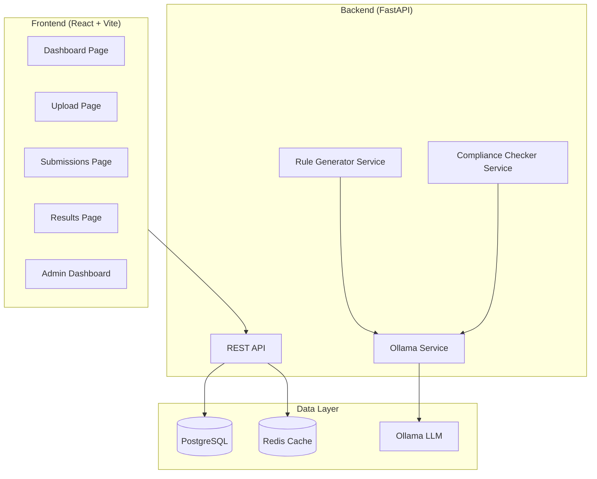
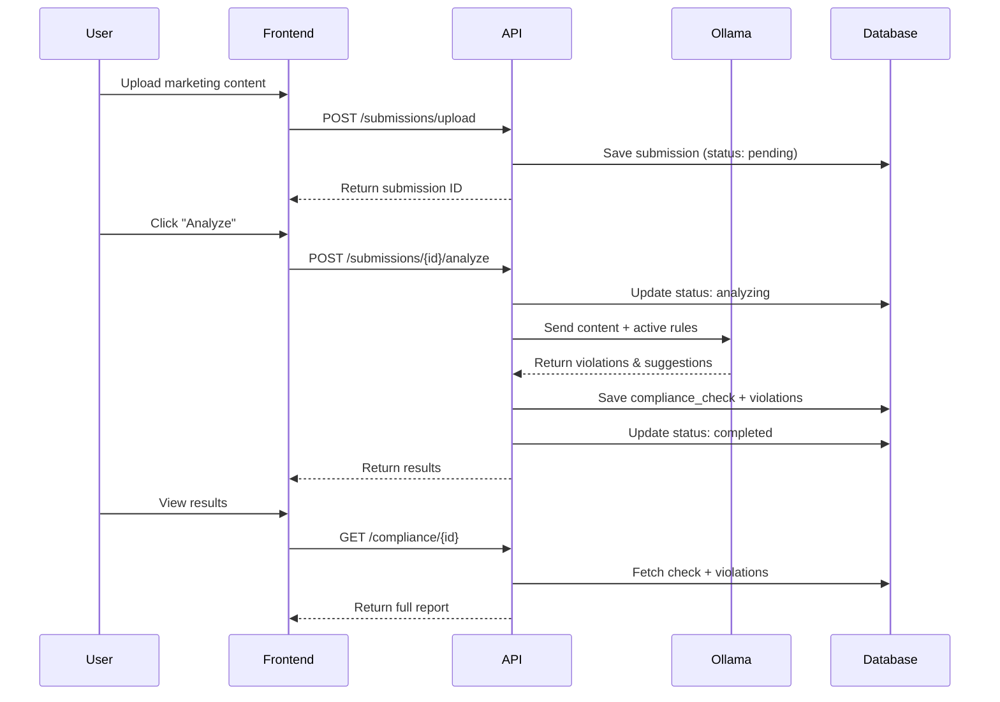
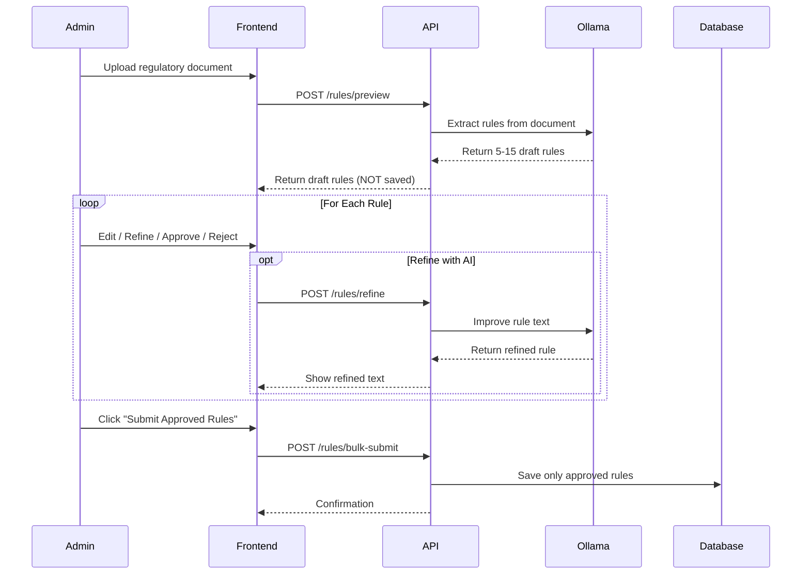

# Compliance Agent - Complete Application Documentation

A comprehensive AI-powered insurance marketing compliance platform that helps organizations ensure their marketing materials meet IRDAI (Insurance Regulatory and Development Authority of India) regulations, brand guidelines, and SEO best practices.

---

## Table of Contents

1. [Overview](#overview)
2. [Architecture](#architecture)
3. [Database Schema](#database-schema)
4. [Features](#features)
5. [API Endpoints](#api-endpoints)
6. [Frontend Pages](#frontend-pages)
7. [How It Works](#how-it-works)
8. [Running the Application](#running-the-application)

---

## Overview

**Compliance Agent** is a full-stack web application that automates the review of insurance marketing content for regulatory compliance. It uses AI (Ollama LLM) to:

- Extract compliance rules from regulatory documents
- Analyze marketing content for violations
- Provide suggested fixes for non-compliant content
- Generate compliance scores and grades

### Tech Stack

| Layer | Technology |
|-------|------------|
| Frontend | React + TypeScript + Vite |
| Styling | Tailwind CSS |
| Backend | FastAPI (Python) |
| Database | PostgreSQL |
| AI/LLM | Ollama (local LLM) |
| Cache | Redis |
| Containerization | Docker Compose |

---

## Architecture



---

## Database Schema

### Tables

#### `users`
Stores user accounts with roles.

| Column | Type | Description |
|--------|------|-------------|
| id | UUID | Primary key |
| name | VARCHAR(255) | User's full name |
| email | VARCHAR(255) | Unique email |
| role | VARCHAR(50) | `super_admin`, `reviewer`, `agent` |
| created_at | TIMESTAMP | Account creation date |

#### `submissions`
Marketing content submitted for compliance review.

| Column | Type | Description |
|--------|------|-------------|
| id | UUID | Primary key |
| title | VARCHAR(500) | Document title |
| content_type | VARCHAR(50) | `html`, `markdown`, `pdf`, `docx` |
| original_content | TEXT | Raw content |
| file_path | VARCHAR(1000) | Path to uploaded file |
| submitted_by | UUID | FK to users |
| submitted_at | TIMESTAMP | Submission time |
| status | VARCHAR(50) | `pending`, `analyzing`, `completed`, `failed` |

#### `compliance_checks`
Results of compliance analysis for each submission.

| Column | Type | Description |
|--------|------|-------------|
| id | UUID | Primary key |
| submission_id | UUID | FK to submissions |
| check_date | TIMESTAMP | When check was performed |
| overall_score | DECIMAL(5,2) | 0-100 compliance score |
| irdai_score | DECIMAL(5,2) | IRDAI compliance score (50% weight) |
| brand_score | DECIMAL(5,2) | Brand guidelines score (30% weight) |
| seo_score | DECIMAL(5,2) | SEO compliance score (20% weight) |
| status | VARCHAR(50) | `passed`, `flagged`, `failed` |
| grade | VARCHAR(2) | A, B, C, D, or F |
| ai_summary | TEXT | AI-generated summary |

#### `rules`
Compliance rules extracted from regulatory documents.

| Column | Type | Description |
|--------|------|-------------|
| id | UUID | Primary key |
| category | VARCHAR(20) | `irdai`, `brand`, `seo` |
| rule_text | TEXT | Detailed rule description |
| severity | VARCHAR(20) | `critical`, `high`, `medium`, `low` |
| keywords | JSONB | Array of trigger keywords |
| pattern | VARCHAR(1000) | Optional regex pattern |
| is_active | BOOLEAN | Whether rule is active |
| created_at | TIMESTAMP | Creation date |

#### `violations`
Individual violations found during compliance checks.

| Column | Type | Description |
|--------|------|-------------|
| id | UUID | Primary key |
| check_id | UUID | FK to compliance_checks |
| rule_id | UUID | FK to rules |
| severity | VARCHAR(20) | Violation severity |
| category | VARCHAR(20) | `irdai`, `brand`, `seo` |
| description | TEXT | What violated the rule |
| location | VARCHAR(500) | Where in document |
| current_text | TEXT | The violating text |
| suggested_fix | TEXT | AI-suggested correction |
| is_auto_fixable | BOOLEAN | Can be auto-corrected |

#### `deep_analysis`
Line-by-line compliance scores for Deep Research Mode.

| Column | Type | Description |
|--------|------|-------------|
| id | UUID | Primary key |
| check_id | UUID | FK to compliance_checks |
| line_number | INTEGER | Line position in document |
| line_content | TEXT | Raw text of the line |
| line_score | DECIMAL(5,2) | Compliance score for this line (0-100) |
| relevance_context | TEXT | AI-generated context (what line is about) |
| rule_impact_breakdown | JSONB | Detailed audit ledger of rule impacts |
| severity_config_snapshot | JSONB | Governance snapshot of weights used |
| created_at | TIMESTAMP | When analysis was performed |

---

## Features

### 1. Dashboard Analytics
Real-time compliance metrics from the database:
- **Overall Score Gauge** - Average compliance score across all submissions
- **Compliance Trend** - Score trends over the last 15 submissions
- **Status Distribution** - Passed/Flagged/Failed breakdown
- **Violation Heatmap** - Violations by category and severity
- **Top Violations** - Most common compliance issues

### 2. Content Upload & Analysis
Upload marketing content for compliance review:
- Supports PDF, DOCX, HTML, and Markdown files
- AI-powered content analysis
- Automatic violation detection
- Suggested fixes for each violation

### 3. Results Page
Detailed compliance report for each submission:
- Category-wise score breakdown (IRDAI, Brand, SEO)
- AI-generated summary
- List of all violations with:
  - Severity badges
  - Current text vs. suggested fix
  - Auto-fix capability for some violations

### 4. Admin Dashboard - Rule Management
Super admins can manage compliance rules:

#### Rule Generation from Documents
1. Upload regulatory document (PDF, DOCX, HTML, MD)
2. AI extracts 5-15 compliance rules
3. **NEW: Preview Panel** - Review before saving:
   - View all extracted rules as cards
   - Edit any rule inline (text, severity, category, points)
   - **Refine with AI** - Improve rules using natural language instructions
   - Approve/Reject individual rules
   - Submit only approved rules to database

#### Rule CRUD Operations
- View all rules with pagination and filters
- Edit existing rules
- Deactivate/Reactivate rules
- Delete all rules (soft delete)

### 5. User Onboarding
First-time visitors see a 4-step welcome tour:
1. Welcome introduction
2. Upload content explanation
3. AI rule generation feature
4. Compliance reports overview

Option to skip or "Don't show again" (saved to localStorage).

### 6. UI/UX (Getsphere-Inspired)
Modern, professional design:
- **Color Palette**: Blue (#3B82F6) to Purple gradients
- **Glassmorphism Header**: Semi-transparent with blur
- **Smooth Animations**: Fade-in, slide-up, bounce effects
- **Premium Cards**: Rounded corners, subtle shadows
- **Responsive Design**: Works on all screen sizes

### 7. Deep Compliance Research Mode ⚡ NEW
Advanced line-by-line analysis with dynamic severity weighting:

#### Severity Weight Configuration
- Interactive sliders for each severity level (critical, high, medium, low)
- Weight range: 0.0 (ignore) to 3.0 (harsh penalties)
- Presets: **Lenient**, **Balanced**, **Strict**

#### Line-by-Line Analysis
- Document segmented into individual lines
- Each line receives its own compliance score
- Expandable cards showing:
  - **Line Score** (0-100 with color coding)
  - **Relevance Context** - AI-generated explanation of what the line is about
  - **Rule Impact Breakdown** - Detailed audit trail showing:
    - Which rules were violated
    - Base deduction amount
    - Weight multiplier applied
    - Final weighted deduction

#### Governance Features
- **Deterministic Scoring**: LLM only detects violations; Python calculates scores
- **Severity Config Snapshot**: Exact weights stored for each analysis run
- **Rule Impact Ledger**: Complete audit trail for compliance audits

---

## API Endpoints

### Dashboard
| Method | Endpoint | Description |
|--------|----------|-------------|
| GET | `/api/dashboard/stats` | Get dashboard statistics |
| GET | `/api/dashboard/recent` | Get recent submissions |

### Submissions
| Method | Endpoint | Description |
|--------|----------|-------------|
| POST | `/api/submissions/upload` | Upload new content |
| GET | `/api/submissions` | List all submissions |
| GET | `/api/submissions/{id}` | Get single submission |
| POST | `/api/submissions/{id}/analyze` | Trigger analysis |
| DELETE | `/api/submissions/{id}` | Delete submission |
| DELETE | `/api/submissions` | Delete all submissions |

### Compliance
| Method | Endpoint | Description |
|--------|----------|-------------|
| GET | `/api/compliance/{submission_id}` | Get compliance results |
| GET | `/api/compliance/{submission_id}/violations` | Get violations list |
| POST | `/api/compliance/{id}/deep-analyze` | Run line-by-line deep analysis |
| GET | `/api/compliance/{id}/deep-results` | Get stored deep analysis results |
| GET | `/api/compliance/{id}/deep-analyze/presets` | Get severity weight presets |

### Admin - Rules (Requires `super_admin` role)
| Method | Endpoint | Description |
|--------|----------|-------------|
| POST | `/api/admin/rules/generate` | Generate & save rules from document |
| POST | `/api/admin/rules/preview` | Generate rules for preview (no save) |
| POST | `/api/admin/rules/refine` | AI-refine a draft rule |
| POST | `/api/admin/rules/bulk-submit` | Save approved draft rules |
| GET | `/api/admin/rules` | List rules with pagination |
| GET | `/api/admin/rules/{id}` | Get single rule |
| POST | `/api/admin/rules` | Create rule manually |
| PUT | `/api/admin/rules/{id}` | Update rule |
| DELETE | `/api/admin/rules/{id}` | Deactivate rule |
| DELETE | `/api/admin/rules` | Deactivate all rules |
| GET | `/api/admin/rules/stats/summary` | Get rule statistics |

---

## Frontend Pages

### `/` - Dashboard
Main analytics dashboard with charts and metrics.

### `/upload` - Upload Content
Form to upload marketing content for review.

### `/submissions` - Submissions List
Table of all submitted content with status badges.

### `/results/{id}` - Compliance Results
Detailed compliance report for a specific submission.

### `/admin` - Admin Dashboard
Rule management interface (requires super_admin).

---

## How It Works

### Compliance Check Flow



### Rule Generation Flow (with Preview)



---

## Running the Application

### Prerequisites
- Docker & Docker Compose
- Node.js 20+ (for local development)
- Python 3.11+ (for local development)

### Quick Start

```bash
# Clone and start with Docker
cd compliance-agent-poc
docker compose up --build

# Access the application
# Frontend: http://localhost:5173
# Backend API: http://localhost:8000
# API Docs: http://localhost:8000/docs
# PgAdmin: http://localhost:5050
```

### Default Users

| Email | Role | User ID |
|-------|------|---------|
| admin@example.com | super_admin | 11111111-1111-1111-1111-111111111111 |

### Environment Variables

See `.env.example` for configuration options:
- `DATABASE_URL` - PostgreSQL connection string
- `REDIS_URL` - Redis connection string  
- `OLLAMA_HOST` - Ollama LLM host URL
- `OLLAMA_MODEL` - Model to use (default: llama3.2)

---

## Key Files Reference

### Backend
- `backend/app/api/routes/admin.py` - Admin rule management endpoints
- `backend/app/api/routes/dashboard.py` - Dashboard stats endpoints
- `backend/app/services/rule_generator_service.py` - AI rule generation
- `backend/app/services/ollama_service.py` - Ollama LLM integration

### Frontend
- `frontend/src/pages/Dashboard.tsx` - Main analytics dashboard
- `frontend/src/pages/AdminDashboard.tsx` - Rule management UI
- `frontend/src/pages/Results.tsx` - Compliance results with Deep Analysis
- `frontend/src/components/admin/RulePreviewPanel.tsx` - Rule preview/edit
- `frontend/src/components/admin/DraftRuleCard.tsx` - Individual rule card
- `frontend/src/components/compliance/DeepAnalysisPanel.tsx` - Deep research mode UI
- `frontend/src/components/compliance/SeverityWeightSlider.tsx` - Weight configuration
- `frontend/src/components/compliance/LineScoreCard.tsx` - Line-by-line display
- `frontend/src/components/onboarding/Onboarding.tsx` - Welcome tour
- `frontend/src/components/layout/Layout.tsx` - App shell with navigation
- `frontend/src/lib/api.ts` - API client
- `frontend/src/lib/types.ts` - TypeScript type definitions

---

*Documentation generated on December 7, 2025*
